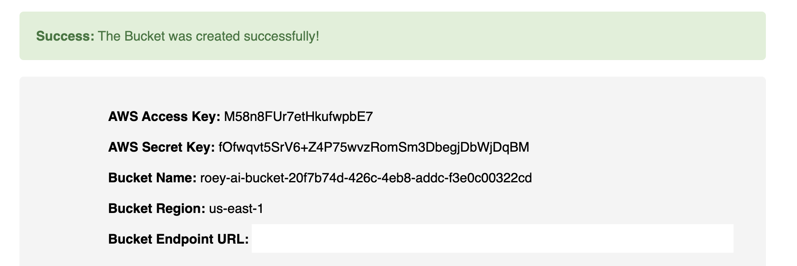

# Flask-OBC App

Flask-OBC app helps non-OpenShift admin users to create Object Bucket Claims with OpenShift ODF for OpenShift AI data connection.


## Overview

The app creates an Object Bucket Claim (OBC) in an existing project and adds `us-east-1` as the bucket region. The app outputs the following data:

- **AWS Access Key**
- **AWS Secret Key**
- **Bucket Name**
- **Bucket Region**
- **Bucket Endpoint URL**

The app is secured with an OAuth Proxy, requiring view permissions to be granted to the appropriate user for access.

```bash
oc -n flask-obc adm policy add-role-to-user view user1
```




## Deployment Steps

1. Create a project named `flask-obc`.
2. Edit the deployment and route YAML files with the cluster API URL and `*.apps` URL.
4. Create random cookie_secret: 
```bash
oc -n flask-obc create secret generic flask-obc-oauth-config --from-literal=session_secret=$(head /dev/urandom | tr -dc A-Za-z0-9 | head -c43)
```
5. Apply all YAML files.

## YAML Files

- [deployment-oauth-proxy.yaml](deployment-oauth-proxy.yaml)
- [flask-obc-oauth-config.yaml](flask-obc-oauth-config.yaml)
- [flask-obc-service.yaml](flask-obc-service.yaml)
- [oauth-sa-secret.yaml](oauth-sa-secret.yaml)
- [oauth-sa.yaml](oauth-sa.yaml)
- [oauth-service.yaml](oauth-service.yaml)
- [rb.yaml](rb.yaml)
- [role-flask-obc.yaml](role-flask-obc.yaml)
- [route.yaml](route.yaml)
- [sa-secret.yaml](sa-secret.yaml)
- [sa.yaml](sa.yaml)

