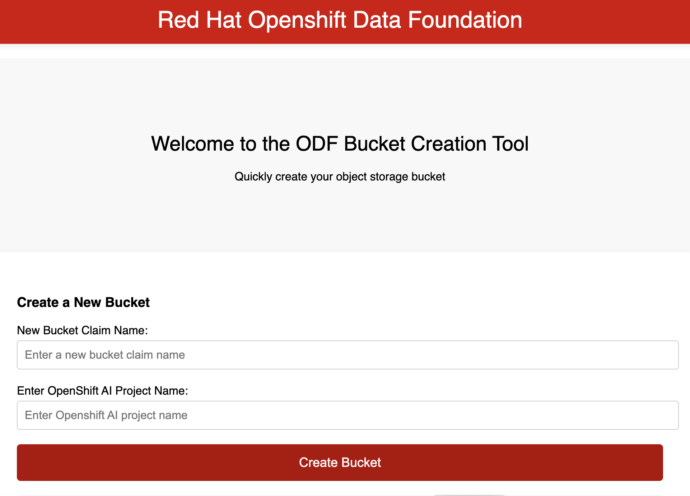

### Flask-obc app help non Openshift admin users to create Object Bucket Claim with Openshift ODF for Openshift AI data connection.

The app creates obc in exsisting project and add us-esat-1 as the bucket region.

The app print out the following data:

    AWS Access Key:

    AWS Secret Key:
    
    Bucket Name: 

    Bucket Region: 

    Bucket Endpoint URL:

Deployment Steps:

1. Create project "flask-obc"
2. Edit deployment and route yaml with the cluster api url and *.apps url
3. Apply all yamls.

